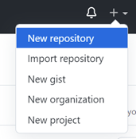
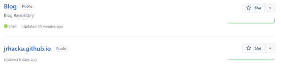
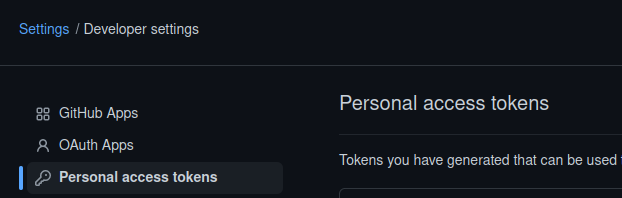

 
### 1 - Create a GitHub Repository and Clone it 


The site I created is a static site via GitHub and using a Hugo theme. Therefore, the first step is setting up your GitHub repository. In order to do this create a free account on https://github.com/. Once you have an account you are going to want to set up two different repositories. We are doing this so one can house content until we push it to the main repository that will host the sites static files.  

```text
A)  Select the plus sign in the top right corner and choose “New Repository” (It may be in a different spot, but should be easy to identify) 

B)  Name it and describe it as whatever really. I named this one blog-site and put some basic description. 

C)  Click create repository 

D)  Repeat this for what will be the site repository. 
   (Note: Name this repository whatever you are going to name the site (enter name here).github.io) 

E)  You should have 2 repositories that look similar to the below. 

F)  Clone your blog repository (git clone xxxxx) 
````



### 2 - Select and Clone your Theme


Go to the Hugo site https://themes.gohugo.io/themes and select your theme. I used “Clarity”, but the process will be similar no matter which theme you choose. Once you have the theme you want, hop back over to your machine and we are going to create the appropriate site. Jump into the equivalent of the “Blog-Site” folder we cloned and run the following command to create a new hugo site.
```bash
hugo new site enternamehere
```  

Once that is done hop into that new folder(titled enternamehere) and find the themes directory. Jump into themes and run git clone on the Hugo repository. There is either a command to copy directly from the page or you can select download and copy the GitHub address.  

```bash
git clone https://siteaddress.com/downloadyourtheme
``` 
{}
Depending on your theme it may be a slightly different process.
{}
 

### 3 - Explore your Theme & the Initial Configuration


Jump into the themes folder, and then into the named folder that matches your theme (/themes/themename/). Check out the contents of that folder and you should see treasure troves of information. In my experience each theme I have toyed with has an “examplesite” folder with sample files and content to use. Somewhere in that folder find the theme.toml/config.toml. Copy that material and paste it into the config.toml in your site folder.  
```bash
subl /home/kali/yourblogfolder/blogname/config.toml
``` 

Be sure to change things appropriately, such as baseurl, and language if needed. Also, take some time here and really dig around in the "examplesite" folder. You will find key examples to use for your own content and site customizations.  


### 4 - "Sync" the Repository with your Machine


Run the command Hugo to create the site locally. It will provide you with your local site address. If you don’t like it then delete the contents in the theme folder and go back to step 2 with your new theme. Depending on which theme you chose it may not run locally but go check the documentation and it should give you good instructions on how to get to that point! If it doesn’t that’s your sign to switch themes. 
```bash
hugo server
``` 

After you have confirmed you like your theme go back to the main directory (../Blog) and now clone your site repository (git clone entername.github.io). Enter that new directory and create something we can use to commit. I created a README.md. Once that is done run the following commands in this order. 

{}
This is a notice that has a lot of various kinds of content in it.  

* Stage your changes
```bash
git add .
```
* Commit your repository
```bash
git commit -m "Enter Commit Text Here"
```
* Push the data through the branch
```bash
git push origin main
```
(On doing this for my second theme I did bump into some problems using my “Password” for Github. If you are having those troubles go into developer settings in the general settings in Github and generate a personal access token to use as your password.) 

* After that is done jump back into your blog repository (In my case /home/kali/Blog-Site/jrhacka). Run the command:
```bash
git submodule add –b main (address of the site repository) public
```
* This creates a “public” folder that will house content. When in that folder you should see your README.md you created in the beginning of step 4. 
* Generate the static files by running 
```bash
hugo -t themename
```
* This will place the static files into the public directory. You will need to run that in order to update the actual site. After that hop into the public folder and run steps A, B, and C again.
{}


### 5 - Change the Style

Now this is more just general advice then an actual step by step guide. Refer to the documentation, open a separate command terminal and deploy the site locally, and bounce between the example site and your actual folder changing files. This is the best way I have found to customize the site as each theme is dramatically different in how they are set up. I would be more than happy to help you research if you bump into problems though! 


### 6 - Upload Content 

When it comes to uploading content, I recommend doing it this way. Find the example you like in the examplesite/content folder (or if not there refer to your theme documentation), copy it to the appropriate folder (such as Blog/jrhacka/content), and then replace it with your content and changes. I always copy those from the examplesite folder, place them in the matching directory path in my actual directory, and just edit the files. It’s much easier that way and saves you a lot of time and effort. 

 
### 7 - Go Live and Enjoy 


Lastly, navigate to the directory where everything is stored (/home/kali/Blog/xxx) and use hugo –t (theme name). Hop in the updated public folder and then run the git trio (add commit push – or steps A, B, & C from section 4). After that just continue to play with your site, but it should be live and rolling! CONGRATS!!! 

Again, if you have any questions feel free to message me via email or any social media site! 

{}
Creating a Blog with Hugo and Github in 10 minutes
    https://www.youtube.com/watch?v=LIFvgrRxdt4

My Theme
    https://themes.gohugo.io/themes/hugo-clarity/

Hugo Quickstart Documentation
    https://gohugo.io/getting-started/quick-start/
{}
